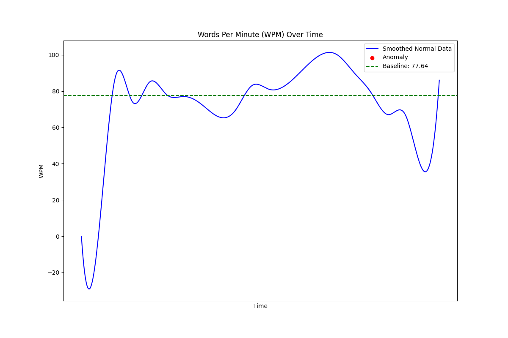

# WPM Monitoring and Anomaly Detection

This repository provides a **Words Per Minute (WPM)** monitoring system with **anomaly detection**. The software calculates WPM in real-time while detecting anomalies based on various algorithms like **Z-Score**, **IQR (Interquartile Range)**, and **DBSCAN**. Additionally, the app generates plots for WPM trends, including detected anomalies, and logs everything for further analysis.

---

## Features

- **Real-time WPM calculation** while typing.
- **Anomaly detection** using:
    - Z-Score method
    - Interquartile Range (IQR) method
    - DBSCAN clustering
- **Graphical visualization** of WPM trends, highlighting anomalies.
- **Configurable settings** for anomaly detection thresholds and logging intervals.
- **Data logging** to capture detailed data for analysis.

---

## How It Works

1. **Real-Time Typing Tracking**:
    - The WPM is calculated based on the number of words typed within a sliding time window.
2. **Anomaly Detection**:
    - Algorithms like Z-Score, IQR, and DBSCAN evaluate the WPM data for irregular patterns.
3. **Data Visualization**:
    - WPM data and anomalies are plotted on a line graph with smooth interpolation.
4. **Data Logging**:
    - All WPM values and anomalies are logged for further inspection.

---

## Example Output

**Sample Log (`wpm_log.log`):**

```textmate

[2025-01-08 16:14:19.170000] WPM: 69
[2025-01-08 16:14:24.205000] WPM: 83
[2025-01-08 16:14:29.237000] WPM: 81
*** [2025-01-08 16:14:34.264000] WPM: 125 - ANOMALY DETECTED! ***
*** [2025-01-08 16:14:39.295000] WPM: 141 - ANOMALY DETECTED! ***
*** [2025-01-08 16:14:44.344000] WPM: 142 - ANOMALY DETECTED! ***
[2025-01-08 16:14:49.368000] WPM: 100
[2025-01-08 16:14:54.401000] WPM: 90
[2025-01-08 16:14:59.406000] WPM: 79

```

**Plot Example (`plot.png`):**

- The WPM graph includes:
    - **Smoothed line graph** for WPM data.
    - **Red dots** marking anomalies.
    - **Green dashed line** as the average WPM baseline.



---

## Installation

1. **Clone the Repository:**
   ```bash
   git clone https://github.com/dixisouls/WPM_Anomaly_Detection.git
   cd WPM_Anomaly_Detection
   ```

2. **Install Dependencies:**
   Make sure Python 3.8 or later is installed, then run:
   ```bash
   pip install -r requirements.txt
   ```

---

## Usage

1. **Run the App**:
   To start monitoring WPM and detecting anomalies, use:
   ```bash
   python main.py
   ```

   Optional Parameters:
    - `--algorithm`: Specify the anomaly detection algorithm (`zscore`, `iqr`, or `dbscan`).
      ```bash
      python main.py --algorithm dbscan
      ```
    - Default: `zscore`


2. **Press Space While Typing**:
    - The app tracks your typing speed (WPM) when you press the spacebar.

3. **Stop the App**:
    - Press **ESC** to stop monitoring.
    - The graph is automatically generated and saved as `plot.png`.

---

## Configuration

You can customize the app's behavior in `config.py`:

- **`WPM_WINDOW_SIZE`**:
    - WPM calculation window in seconds (default: `15` seconds).
- **`ZSCORE_THRESHOLD`**:
    - Z-Score value to classify anomalies (default: `3.0`).
- **`LOG_INTERVAL`**:
    - How often WPM is logged (default: `5` seconds).
- **`DBSCAN_EPSILON`**:
    - The epsilon parameter for DBSCAN (default: `10`).

---

## File Overview

1. **`main.py`**:
    - Entry point for the application, integrates logging, monitoring, plotting, and anomaly detection.
2. **`data_plotter.py`**:
    - Handles WPM graph plotting with anomaly highlights and smoothing.
3. **`anomaly_detector.py`**:
    - Implements anomaly detection algorithms (Z-Score, IQR, DBSCAN).
4. **`wpm_monitor.py`**:
    - Tracks WPM within a sliding time window.
5. **`data_logger.py`**:
    - Logs WPM data and anomalies in a specified file.
6. **`config.py`**:
    - Configuration file for adjustable application parameters.
7. **`requirements.txt`**:
    - Required dependencies for the project.

---

## Example Graph

Generated graph highlighting anomalies and showing a trend line (using smoothed interpolation):


---

## Requirements

- Python >=3.8
- Key libraries: `matplotlib`, `numpy`, `scipy`, `pynput`, `scikit-learn`.

Install all dependencies with:
```bash
pip install -r requirements.txt
```

---


## Future Enhancements

- Add more advanced algorithms for anomaly detection.
- Provide export options for interactive plots.
- Enable live updates to the graph during monitoring.

---